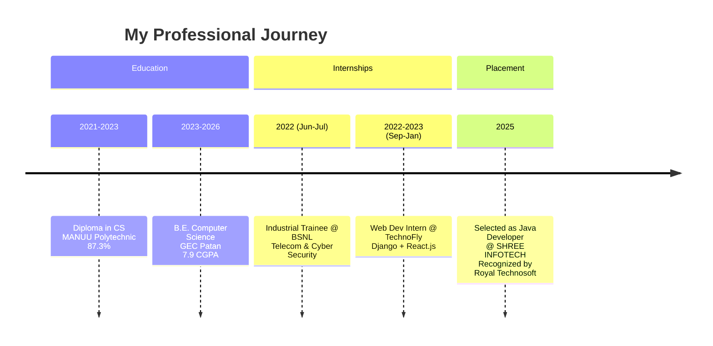
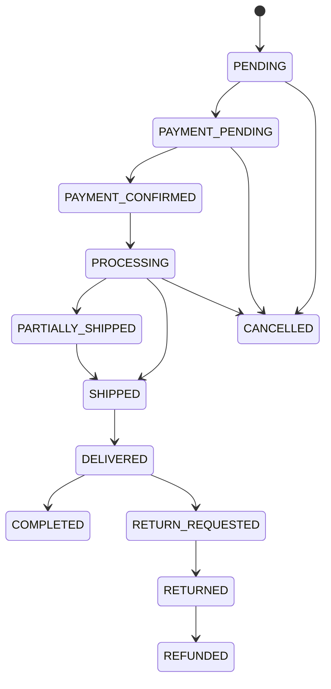

<!-- ========== ANIMATED HEADER BANNER ========== -->
<p align="center">
  
</p>

<!-- ========== TYPING ANIMATION INTRO ========== -->
<p align="center">
  
</p>

<!-- ========== PROFILE VIEWS + FOLLOWERS BADGE ========== -->
<p align="center">
  
  
  
  
  
</p>

---

<!-- ========== 🔥 ACHIEVEMENT HIGHLIGHT BANNER ========== -->
<p align="center">
  
</p>

## 🏆 Major Career Achievement – Placement Recognition

> **Recognized by Royal Technosoft Pvt. Limited** for successfully placing **Md Sadique Amin** at **SHREE INFOTECH** as a **Java Developer**.

I am deeply honored to share that my technical skills, consistency, and dedication have been officially recognized by **Royal Technosoft Pvt. Limited** – a leading recruitment and training partner. This achievement marks a significant milestone in my journey as a software engineer.

### 🌟 Key Placement Highlights
- ✅ **Selected as Java Developer** at **SHREE INFOTECH** – a fast‑growing IT solutions company.
- ✅ Recognized by **Royal Technosoft Pvt. Limited** with a formal achievement award.
- ✅ The award citation reads:  
  > *"Wishing continued success and career growth"* – Royal Technosoft Pvt. Limited
- ✅ This placement validates my strong foundation in **Java, Spring Boot, and full‑stack enterprise development**.

---

### 🎓 Academic & Internship Achievements
- 🥇 **Top 10%** in Department (CSE) – Consecutive semesters
- 🏅 **College Merit Scholarship** (2024‑25)
- 🏆 **Best Project Award** – EntityKart e‑commerce platform at GEC Patan Tech Fest 2025
- 💻 **Smart India Hackathon 2025 Finalist** – Software edition
- 📄 **Published Technical Writer** – 5+ articles on Java, Spring Boot (10k+ reads)
- 🔧 **Open Source Contributor** – 2 merged PRs to a CRUD generator tool

---

### 💼 Career Milestone Timeline



---

# 💎 SANAB — Enterprise Jewellery & Cosmetics Commerce Platform
### **Antigravity Technology | Master Enterprise Implementation Blueprint**
**Version 1.0 — Approved Architecture Blueprint**  
*Engineering Philosophy: Build once. Build correctly. Build securely. Build maintainably. Build for production.*

---

## 🛠️ Technology Stack (Verified Stable, July 2026)

### Backend (Spring Boot Modular Monolith)
| Technology | Version | Notes |
| :--- | :--- | :--- |
| **Java** | 25 LTS | Released Sep 2025; Scoped values, virtual threads, flexible constructors |
| **Spring Boot** | 4.1.x | Released Nov 2025; Spring Framework 7, requires Java 17+ |
| **Spring Security** | 7.x | Bundled with Boot 4 |
| **Spring Modulith** | 2.x | Modular monolith enforcement + architecture verification |
| **Hibernate ORM** | 7.x | Bundled with Boot 4 |
| **MapStruct** | 1.6.x | High performance compile-time DTO mapping |
| **Maven** | 3.9.x | Multi-module build lifecycle management |
| **PostgreSQL** | 17.x | Multi-schema enterprise database |
| **Redis** | 8.x | Token blacklist, session cache, rate limiting |
| **Flyway** | 10.x | Database schema migration management |
| **Jackson** | 2.18.x | JSON serialization & deserialization |

### Frontend (Next.js 16 Storefront & Admin)
| Technology | Version | Notes |
| :--- | :--- | :--- |
| **Next.js** | 16.2.12 | Turbopack default, explicit caching APIs |
| **React** | 19.x | Server components, Server Actions |
| **TypeScript** | 5.x | Strict mode |
| **Tailwind CSS** | 4.3.x | CSS-first config, Rust engine |
| **shadcn/ui** | latest | Radix UI accessible components |
| **TanStack Query** | 5.x | Client-side state & server synchronization |
| **TanStack Table** | 8.x | Enterprise datatable grids |
| **React Hook Form** | 7.x | Performance form state handling |
| **Zod** | 3.x | Runtime schema validation |
| **Motion (Framer)**| 11.x | Smooth UI transitions & dynamic animations |
| **GSAP** | 3.x | High-end micro-interactions |
| **Lucide React** | latest | Modern icon library |
| **Sonner** | latest | Toast notification engine |

---

## 📂 Project Structure Overview

```
sanab/
├── sanab-backend/                    # Spring Boot Modular Monolith (Maven Multi-Module)
│   ├── pom.xml                       # Parent POM
│   ├── sanab-app/                    # Application entry point + config
│   ├── sanab-shared/                 # Shared kernel (base entities, utils, constants)
│   ├── sanab-security/               # Security module (JWT, tokens, filters)
│   ├── sanab-identity/               # Auth + user accounts
│   ├── sanab-catalog/                # Products, categories, brands, variants
│   ├── sanab-inventory/              # Stock management
│   ├── sanab-cart/                   # Shopping cart
│   ├── sanab-orders/                 # Orders, checkout
│   ├── sanab-payments/               # Payment processing
│   ├── sanab-shipping/               # Shipping + tracking
│   ├── sanab-returns/                # Returns + refunds
│   ├── sanab-promotions/             # Coupons, gift cards, loyalty
│   ├── sanab-reviews/                # Reviews + ratings
│   ├── sanab-notifications/          # Email, SMS, WhatsApp, in-app
│   ├── sanab-search/                 # Product search
│   ├── sanab-cms/                    # CMS, blog, FAQ, banners
│   ├── sanab-support/                # Ticket system, contact
│   ├── sanab-analytics/              # Reports, dashboard
│   ├── sanab-admin/                  # Admin settings, audit logs
│   └── sanab-customer/               # Customer profiles, addresses, wishlist
│
└── sanab-frontend/                   # Next.js 16 Application
    ├── app/                          # App Router (Next.js)
    │   ├── (auth)/                   # Auth routes
    │   ├── (shop)/                   # Storefront routes
    │   ├── (account)/                # Customer portal
    │   ├── (admin)/                  # Admin panel
    │   └── api/                      # Route handlers
    ├── components/                   # Shared UI components
    ├── features/                     # Feature-based components
    ├── hooks/                        # Custom React hooks
    ├── lib/                          # Utilities, API clients
    ├── store/                        # Client state (Zustand)
    ├── styles/                       # Global CSS, Tailwind theme
    └── types/                        # TypeScript types + Zod schemas
```

### Backend Module Internal Package Layout
Every domain module follows strict package encapsulation:
```
sanab-{module}/
└── src/main/java/com/antigravity/sanab/{module}/
    ├── api/
    │   ├── controller/               # REST controllers (thin — no logic)
    │   ├── dto/
    │   │   ├── request/              # Immutable request DTOs (records)
    │   │   └── response/             # Immutable response DTOs (records)
    │   └── validator/                # Custom constraint validators
    ├── application/
    │   ├── service/                  # Business logic (interfaces)
    │   ├── impl/                     # Service implementations
    │   ├── mapper/                   # MapStruct mappers
    │   ├── event/                    # Domain events
    │   └── listener/                 # Event listeners
    ├── domain/
    │   ├── entity/                   # JPA entities (extends BaseEntity)
    │   ├── repository/               # Spring Data JPA repositories
    │   ├── specification/            # JPA Specifications (dynamic queries)
    │   └── enums/                    # Domain enumerations
    ├── infrastructure/
    │   ├── config/                   # Module-specific configuration
    │   ├── cache/                    # Redis cache adapters
    │   ├── persistence/              # Custom query implementations
    │   └── external/                 # External service adapters
    └── exception/                    # Module-specific exceptions
```

---

## 🏛️ Phase 0 — Enterprise Planning Deliverables

### Domain Model (DDD Bounded Contexts Map)

```
┌─────────────────────────────────────────────────────────────────┐
│                         SANAB DOMAIN MAP                        │
├──────────────┬───────────────┬───────────────┬─────────────────┤
│   IDENTITY   │   CATALOG     │  TRANSACTION  │    CUSTOMER     │
│              │               │               │                 │
│ • User       │ • Product     │ • Cart        │ • Profile       │
│ • Role       │ • Category    │ • Order       │ • Address       │
│ • Permission │ • Brand       │ • Payment     │ • Wishlist      │
│ • Session    │ • Variant     │ • Shipping    │ • LoyaltyPoints │
│ • Device     │ • Inventory   │ • Return      │ • GiftCard      │
│              │               │ • Refund      │                 │
├──────────────┼───────────────┼───────────────┼─────────────────┤
│  ENGAGEMENT  │    CONTENT    │   ANALYTICS   │    PLATFORM     │
│              │               │               │                 │
│ • Review     │ • Blog        │ • Report      │ • Notification  │
│ • Rating     │ • FAQ         │ • Dashboard   │ • Email         │
│ • Coupon     │ • Banner      │ • AuditLog    │ • SMS           │
│ • Promotion  │ • CMS Page    │ • ActivityLog │ • WhatsApp      │
│              │               │               │ • Search        │
│              │               │               │ • Support       │
└──────────────┴───────────────┴───────────────┴─────────────────┘
```

### User Roles Matrix
| Role | Description |
| :--- | :--- |
| `SUPER_ADMIN` | Full system access, platform management & tenant config |
| `ADMIN` | Administrative operations, catalog management, order processing |
| `CONTENT_MANAGER` | CMS pages, blog posts, banners, FAQs |
| `SUPPORT_AGENT` | Ticket resolution & customer inquiries |
| `CUSTOMER` | Shopping experience, order history, profile management |
| `GUEST` | Read-only browsing (non-authenticated) |

### API Versioning Strategy
- Base Path: `/api/v1/`
- Versioning via URL path prefix
- Backward compatibility guaranteed within major version
- Breaking changes require minor version bump and deprecation headers

---

## 🧱 Phase 1 — Foundation: Shared Kernel

### Base Entity Design
```java
// com.antigravity.sanab.shared.domain.entity.BaseEntity
@MappedSuperclass
@EntityListeners(AuditingEntityListener.class)
public abstract class BaseEntity {
    @Id
    @GeneratedValue(strategy = GenerationType.UUID)
    @Column(updatable = false, nullable = false)
    private UUID id;

    @CreatedDate
    @Column(updatable = false, nullable = false)
    private Instant createdAt;

    @LastModifiedDate
    @Column(nullable = false)
    private Instant updatedAt;

    @CreatedBy
    @Column(updatable = false)
    private String createdBy;

    @LastModifiedBy
    private String updatedBy;

    // Soft delete support
    private boolean deleted = false;
    private Instant deletedAt;
    private String deletedBy;

    // Optimistic locking
    @Version
    private Long version;
}
```

### Global API Response Wrapper
```java
// com.antigravity.sanab.shared.api.response.ApiResponse<T>
public record ApiResponse<T>(
    boolean success,
    String message,
    T data,
    ApiError error,
    String requestId,
    Instant timestamp
) {
    public static <T> ApiResponse<T> success(T data, String message) { ... }
    public static <T> ApiResponse<T> error(ApiError error) { ... }
}
```

---

## 🔒 Phase 2 — Enterprise Security Architecture

### JWT Token Strategy Lifecycle

```
┌────────────────────────────────────────────────────────────────┐
│                     TOKEN LIFECYCLE                            │
├────────────────────────────────────────────────────────────────┤
│  Access Token:  15 minutes  │  RS256  │  Stateless JWT         │
│  Refresh Token: 30 days     │  RS256  │  Opaque → Redis lookup │
│                                                                │
│  Rotation: Every refresh issues new refresh token              │
│  Revocation: Redis blacklist (access) + DB invalidation (refresh)│
│  Family tracking: Prevents refresh token replay attacks        │
└────────────────────────────────────────────────────────────────┘
```

### Security Filter Chain Order
1. `CorrelationIdFilter` — Inject unique request ID
2. `SecurityHeadersFilter` — Enforce CSP, HSTS, X-Frame-Options
3. `RateLimitingFilter` — Per-IP, per-user, per-endpoint rate limiting via Redis
4. `IpThrottlingFilter` — Block abusive IP ranges
5. `JwtAuthenticationFilter` — Validate access token signature & claims
6. `SessionValidationFilter` — Verify active device/session state in Redis
7. Method-level Authorization via Spring Security (`@PreAuthorize`)

### OWASP Top 10 Mitigation Matrix
| OWASP Vulnerability | Technical Mitigation Strategy |
| :--- | :--- |
| **A01 Broken Access Control** | Role-based (RBAC) + Permission-based (PBAC) + Resource ownership validation |
| **A02 Cryptographic Failures** | TLS 1.3, Argon2id password hashing, RS256 signed JWT tokens |
| **A03 Injection** | Hibernate ORM parameterized queries, Bean Validation 3.x |
| **A04 Insecure Design** | Security-by-design, threat modeling, modular boundaries |
| **A05 Security Misconfiguration** | Strict CSP headers, security headers filter, audit trail |
| **A06 Vulnerable Components** | Automated dependency scanning & managed versions |
| **A07 Auth Failures** | JWT token rotation, TOTP/SMS MFA, brute-force lockout rules |
| **A08 Software Integrity** | Signed commits, dependency checksum verification |
| **A09 Security Logging** | Structured JSON audit logs with correlation IDs |
| **A10 SSRF** | Strict URL allowlisting for external webhook calls |

---

## ⚡ Phase 3 — Core Module Specifications & State Machines

### Orders State Machine



### Payments Integration (Adapter Pattern)
- **Primary Gateway**: Authorize.Net / Stripe
- **Backup/Local**: Cash on Delivery (COD), Digital Wallets
- **Security Compliance**: PCI-DSS compliant (Zero raw card storage)

---

## 🎨 Phase 4 — Frontend Architecture (Next.js 16)

### Tailwind CSS v4 Design Tokens
```css
/* app/styles/globals.css */
@import "tailwindcss";

@theme {
  /* Brand Color Palette */
  --color-gold-50: oklch(98% 0.02 85);
  --color-gold-500: oklch(75% 0.15 85);
  --color-gold-900: oklch(30% 0.08 85);
  
  --color-obsidian-50: oklch(97% 0.005 250);
  --color-obsidian-900: oklch(12% 0.01 250);
  
  /* Typography */
  --font-display: 'Playfair Display', serif;
  --font-body: 'Inter', sans-serif;
  
  /* Animation Easing */
  --ease-smooth: cubic-bezier(0.4, 0, 0.2, 1);
  --ease-bounce: cubic-bezier(0.34, 1.56, 0.64, 1);
}
```

---

## 🗄️ Phase 5 — Database Engineering & Migration Strategy

### Schema Strategy & Key Indexes
- Schema-per-module isolation (`identity`, `catalog`, `orders`, `payments`, `customers`, etc.)
- Dynamic Full-Text Search GIN index:
  ```sql
  CREATE INDEX idx_products_fts ON catalog.products 
    USING GIN(to_tsvector('english', name || ' ' || COALESCE(description, '')));
  ```
- Partial Indexes for high performance queries:
  ```sql
  CREATE INDEX idx_products_active ON catalog.products(category_id, created_at)
    WHERE deleted = false AND status = 'ACTIVE';
  ```

---

## 📡 Phase 6 — Notification Engine Architecture

```
┌─────────────────────────────────────────────────────────────────┐
│                    NOTIFICATION ENGINE                          │
├─────────────────────────────────────────────────────────────────┤
│                                                                  │
│  Domain Event → NotificationEventListener → NotificationService │
│                                                     │           │
│                              ┌──────────────────────┘           │
│                              ▼                                  │
│                    TemplateResolver (Thymeleaf)                 │
│                              │                                  │
│              ┌───────────────┼───────────────┐                  │
│              ▼               ▼               ▼                  │
│         EmailChannel     SMSChannel    WhatsAppChannel          │
│         (JavaMail)       (Twilio)     (Twilio/Meta API)        │
│              │               │               │                  │
│              └───────────────┴───────────────┘                  │
│                              ▼                                  │
│                    Retry + Dead Letter Queue                    │
│                    (Spring Retry + DB log)                      │
└─────────────────────────────────────────────────────────────────┘
```

---

## 🚀 Phase 7 — Caching & Performance Strategy

### Redis Caching Matrix
| Cache Key Pattern | TTL | Strategy | Invalidation Strategy |
| :--- | :--- | :--- | :--- |
| `product:{slug}` | 30 mins | Read-through | On product catalog update |
| `category:tree` | 60 mins | Cache-aside | On category hierarchy mutation |
| `user:session:{token}` | 15 mins | Write-through | On session invalidation / logout |
| `ratelimit:{ip}:{endpoint}` | 1 min | Sliding window | Automatic Redis TTL expiration |
| `cart:{userId}` | 24 hrs | Write-through | On item addition / checkout |

---

## 🗝️ Phase X — External Services & Secrets Configuration

> ⚠️ **Security Warning**: Secrets must come from environment variables. Never commit actual secret values to Git repositories.

### Environment Variable Mapping
| Service | Environment Variable | Usage |
| :--- | :--- | :--- |
| **PostgreSQL** | `SPRING_DATASOURCE_URL`, `SPRING_DATASOURCE_USERNAME`, `SPRING_DATASOURCE_PASSWORD` | Primary PostgreSQL 17 Cloud DB |
| **Twilio** | `TWILIO_ACCOUNT_SID`, `TWILIO_AUTH_TOKEN`, `TWILIO_PHONE_NUMBER` | SMS & WhatsApp Notifications / OTP |
| **Cloudinary** | `CLOUDINARY_CLOUD_NAME`, `CLOUDINARY_API_KEY`, `CLOUDINARY_API_SECRET` | Product image asset management |
| **Authorize.Net** | `AUTHORIZE_NET_LOGIN_ID`, `AUTHORIZE_NET_TRANSACTION_KEY` | Primary Payment Gateway |

---

## 🧠 Tech Stack & Developer Skills

| Category | Technologies & Frameworks |
| :--- | :--- |
| **Languages** | Java (25 LTS), Python, JavaScript, TypeScript, SQL, C |
| **Backend** | Spring Boot 4.1.x, Spring Security, Spring Modulith, Django, REST APIs, Microservices, JWT |
| **Frontend** | Next.js 16, React 19, HTML5, CSS3, Tailwind CSS v4, Redux Toolkit, Zustand |
| **Databases** | PostgreSQL 17, Redis 8, MySQL, MongoDB |
| **AI/ML** | TensorFlow, PyTorch, Scikit-learn, OpenCV, NLTK, LLM Integration |
| **Data Science** | Pandas, NumPy, Matplotlib, Tableau, Big Data Pipelines |
| **DevOps & Tools** | Git, GitHub, Docker, AWS (EC2/S3), Kafka, Spark, Maven, Flyway |

### Badges Showcase


---

## 📊 GitHub Stats & Activity

<p align="center">
  
  
</p>

<p align="center">
  
</p>

<p align="center">
  
</p>

<!-- ========== CONTRIBUTION SNAKE ANIMATION ========== -->
<p align="center">
  <picture>
    <source media="(prefers-color-scheme: dark)" srcset="https://raw.githubusercontent.com/Sadique721/Sadique721/output/github-contribution-grid-snake-dark.svg">
    <source media="(prefers-color-scheme: light)" srcset="https://raw.githubusercontent.com/Sadique721/Sadique721/output/github-contribution-grid-snake.svg">
    
  </picture>
</p>

---

## 🔥 Featured Projects

| Project | Description | Tech Stack |
| :--- | :--- | :--- |
| **[SANAB Platform](https://github.com/Sadique721/Enterprise-Jewellery-Cosmetics-Commerce-Platform)** | Enterprise Jewellery & Cosmetics Commerce Monolith | Java 25, Spring Boot 4.1, Next.js 16, PostgreSQL 17 |
| **[MSA – Offline AI Agent](https://github.com/Sadique721/AI-Agent-MSA)** | Local AI assistant with voice & Android ADB controls | Python, Vosk, Llama 2, ADB |
| **[Entitykart](https://github.com/Sadique721/Entitykart)** | Full-featured E-Commerce system | Spring Boot, React, JWT, MySQL |
| **[Ethical Hacking Portal](https://github.com/Sadique721/ethical-hacking-portal)** | Cybersecurity learning environment | Django, Python, SQLite |
| **[Recipe Finder Pro](https://github.com/Sadique721/Recipe-finder-pro-)** | Instant recipe search with dark mode UI | React.js, REST APIs |

---

## 🏆 GitHub Achievements

<p align="center">
  <a href="https://github.com/Sadique721?tab=achievements">
    
  </a>
  <a href="https://github.com/Sadique721?tab=achievements">
    
  </a>
  <a href="https://github.com/Sadique721?tab=achievements">
    
  </a>
  <a href="https://github.com/Sadique721?tab=achievements">
    
  </a>
</p>

---

## 📫 Connect & Social Links

<p align="center">
  <a href="https://www.linkedin.com/in/md-sadique-amin-b6a948198/"></a>
  <a href="https://github.com/Sadique721"></a>
  <a href="http://www.youtube.com/@mdsadiqueamin721"></a>
  <a href="mailto:mdsadiqueamin721786@gmail.com"></a>
</p>

<!-- ========== FOOTER WAVE ANIMATION ========== -->
<p align="center">
  
</p>

<p align="center">
  <i>“Code. Create. Decentralize. Build for Production.”</i>
</p>
